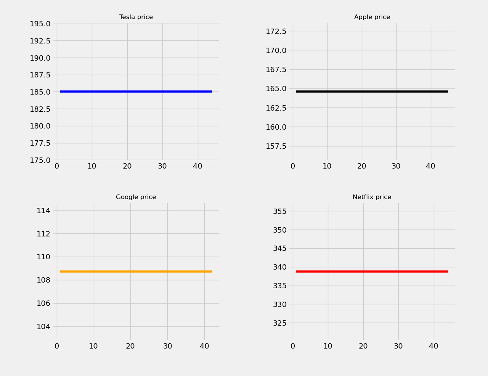

A Flink application project using Scala and SBT.

In our Apache Flink data processing pipeline, we used the window sliding method with a window size of 10 seconds and a slide length of 5 seconds.

Make sure you have JVM, Scala and SBT installed.
1. Change application configuration in file `src/main/resources/application.conf`
````
API_KEY = --RealStoncks API key--
OUTPUT_FOLDER = --Directory where flink sinks data--
````
2. Change Python script input directory in file `plotting/plotting.py`
```python
folder_path = "OUTPUT_FOLDER\\output"
```
3. Start flink sever
````bash
sbt run
````
4. Run python script. Make sure to wait for flink to generate necessary files.
````bash
python plotting/plotting.py
````

The output of visualisation should look similar to this,

Note - Stock prices are temporarily constant since we are in non-working days.